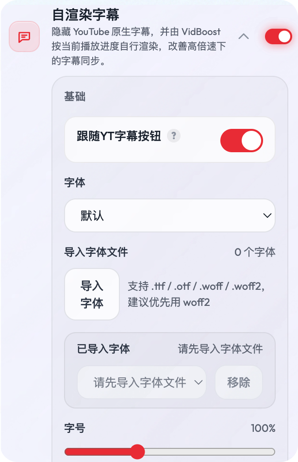
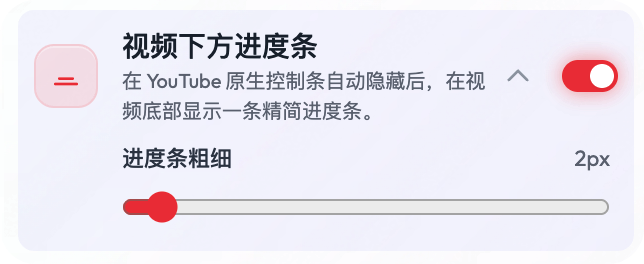

# VidBoost

<p align="center">
  <strong>简体中文</strong> | <a href="./README.en.md">English</a>
</p>

<p align="center">
  <a href="https://chromewebstore.google.com/detail/vidboost/bjehghokgbfmceggcbpjgmahgjgpgbia?authuser=0&hl=zh-CN">
    
  </a>
  <a href="https://microsoftedge.microsoft.com/addons/detail/pkfejgamamjcgcbdhejojieenlchbgod">
    
  </a>
  <a href="https://addons.mozilla.org/en-US/firefox/addon/vidboost-video-toolkit/">
    
  </a>
  <a href="https://developer.chrome.com/docs/extensions/develop/migrate/what-is-mv3">
    
  </a>
  <a href="https://svelte.dev/">
    
  </a>
  <a href="https://www.typescriptlang.org/">
    
  </a>
  <a href="https://vite.dev/">
    
  </a>
</p>


把我认为一些很实用的功能，从各个脚本或插件整合到这一个插件里面

## 安装


| 渠道           |                           下载链接                           |                           当前版本                           |                       用户数 / 下载量                        |
| :------------- | :----------------------------------------------------------: | :----------------------------------------------------------: | :----------------------------------------------------------: |
| Chrome         | [Chrome Web Store - VidBoost](https://chromewebstore.google.com/detail/vidboost/bjehghokgbfmceggcbpjgmahgjgpgbia?authuser=0&hl=zh-CN) | [](https://chromewebstore.google.com/detail/vidboost/bjehghokgbfmceggcbpjgmahgjgpgbia?authuser=0&hl=zh-CN) | [](https://chromewebstore.google.com/detail/vidboost/bjehghokgbfmceggcbpjgmahgjgpgbia?authuser=0&hl=zh-CN) |
| Microsoft Edge | [Microsoft Edge Add-ons - VidBoost](https://microsoftedge.microsoft.com/addons/detail/pkfejgamamjcgcbdhejojieenlchbgod) | [](https://microsoftedge.microsoft.com/addons/detail/pkfejgamamjcgcbdhejojieenlchbgod) | [](https://microsoftedge.microsoft.com/addons/detail/pkfejgamamjcgcbdhejojieenlchbgod) |
| Firefox        | [Firefox Browser Add-ons - VidBoost Video Toolkit](https://addons.mozilla.org/en-US/firefox/addon/vidboost-video-toolkit/) | [](https://addons.mozilla.org/en-US/firefox/addon/vidboost-video-toolkit/) | [](https://addons.mozilla.org/en-US/firefox/addon/vidboost-video-toolkit/) |
| GitHub Release | [GitHub Releases](https://github.com/tunecc/VidBoost/releases) | [](https://github.com/tunecc/VidBoost/releases) | [](https://github.com/tunecc/VidBoost/releases) |


## 插件预览

<p align="center">
  
  &nbsp;
  
</p>


## 功能总览

### 通用增强

#### 1. h5player 快捷倍速控制

参考：基于 [xxxily/h5player](https://github.com/xxxily/h5player)，并整合了我自己精简过的 [tunecc/h5player](https://github.com/tunecc/h5player)。

适用于大多数 HTML5 视频网站，不只限于 YouTube 或 Bilibili。核心就是统一一套顺手的快捷键，不用每到一个站点都重新适应播放器。

- `1-6` 直接切到 1x-6x
- `C / X / Z` 加速、减速、切换或重置速度
- `Enter` 全屏
- `← / →` 快退、快进
- 支持自定义调速步长、最大倍速、快进快退秒数

我自己主要拿它看 YouTube、B 站和网课，也在不少常见 HTML5 站点上用。

兼容优化：

- 抖音高倍速守护。超过 `3x` 的倍速在抖音经常会被页面逻辑重置，VidBoost 会在你调到高倍速后尽量守住当前速度。

<p align="center">
  
</p>


#### 2. 自动暂停

参考：灵感来自 `Enhancer for YouTube ™` 的 `自动暂停在后台标签中打开的视频` 功能，并基于我自己的 [tunecc/video-auto-pause](https://github.com/tunecc/video-auto-pause) 做了扩展整合。

切到别的标签页，或者浏览器窗口失焦时，正在播放的视频会自动暂停；切回来再继续。

用法：

- 全站生效
- 仅对指定站点生效
- 自定义补充域名
- 允许后台继续播放，用来挂机听歌或播长音频

<p align="center">
  
</p>


#### 3. 极速暂停 / 禁用双击全屏

参考：https://greasyfork.org/zh-CN/scripts/448770-%E5%93%94%E5%93%A9%E5%93%94%E5%93%A9%E5%8F%96%E6%B6%88%E5%8F%8C%E5%87%BB%E5%85%A8%E5%B1%8F

这个功能就是为了解决一个很烦但很常见的问题：想单击暂停，结果双击进了全屏。

它会做两件事：

- 禁用视频区域的双击全屏
- 尽量把暂停 / 播放响应提前，让连续点击更稳一点

目前主要针对 YouTube 和 Bilibili 这类高频点击场景做了适配。

<p align="center">
  
</p>


#### 4. 统计面板网速换算

参考：https://greasyfork.org/zh-CN/scripts/560641-youtube-%E7%BD%91%E9%80%9F%E5%8D%95%E4%BD%8D%E8%BD%AC%E6%8D%A2%E5%99%A8

在 YouTube 和 Bilibili 的统计信息面板里，站点通常只给 `Kbps`。启用后，VidBoost 会在后面补一个 `MB/s` 换算值，看网速更直接。

当前支持：

- YouTube `Stats for nerds / 详细统计信息` 里的 `Connection Speed / 连接速度`
- Bilibili 统计信息面板里的 `Video Speed / Audio Speed`

### YouTube 专属增强

<p align="center">
  
</p>


#### 1. 屏蔽原生数字键跳进度

YouTube 原生的 `0-9` 数字键会跳进度，正好和上面的快捷倍速撞车。

启用后会拦掉这套行为，免得本来想切到 `3x`，结果视频直接跳到 `30%`。

#### 2. 始终使用原始音频

参考：https://github.com/insin/control-panel-for-youtube

当 YouTube 视频有多音轨时，VidBoost 会自动切到标记为 `Original / 原始 / 原声` 的轨道，适合不想被自动配音或翻译音轨打断的时候。

- 支持普通视频页
- 支持 Shorts
- 只在页面存在多音轨时介入

#### 3. 显示当前 CDN 国家

参考：https://www.nodeseek.com/post-573621-1

播放 YouTube 时，VidBoost 会识别当前视频分片命中的 `googlevideo` 播放链路，把对应国家直接显示在播放器控制条里。

- 支持普通视频页
- 支持 Shorts
- 跟随 VidBoost 当前语言显示国家名称
- 显示的是当前播放链路命中的 CDN 国家，不是视频上传地区

这个功能主要是拿来看线路，不是拿来切 CDN。

比较适合这些场景：

- 当前代理 / 出口实际落到哪个国家
- 播放过程中 CDN 是否发生切换
- 不同网络或代理线路下的节点调度差异

#### 4. 自渲染字幕

参考：https://github.com/mengxi-ream/read-frog 的双语字幕

启用后会隐藏 YouTube 原生字幕层，再按当前播放进度和播放速度重新渲染到播放器里，主要是为了解决 h5player 高倍速下原生字幕容易不同步的问题。

当前支持：

- 跟随 YouTube 播放器的字幕开关
- 自定义字体、字号、字重、颜色、透明度、背景和圆角
- 组合多种描边 / 投影 / 浮雕效果
- 导入自定义字幕字体
- 在高倍速场景下尽量保持字幕时间同步

<p align="center">
    
  </p>


#### 5. 记住 YouTube 字幕状态

参考：https://github.com/xlch88/YouTubeTweak

YouTube 原生字幕的开关状态默认不太稳定，换视频、换频道后经常要重新点一次 CC。

启用后，VidBoost 会记住 YouTube 播放器原生 CC 字幕按钮的开关状态，并在打开新视频时自动恢复。

支持两种记忆范围：

- 按频道分别记住：默认模式，每个频道单独保存字幕开关状态，没有频道记录时再用全局状态兜底
- 全部视频共用：所有 YouTube 视频共用同一个字幕开关偏好

这个功能可以单独使用，不要求开启上面的自渲染字幕。

#### 6. 视频下方进度条

参考：https://github.com/xlch88/YouTubeTweak

启用后，会在视频底部额外显示一条精简进度条。

当前行为：

- 仅在 YouTube 原生控制条自动隐藏后显示
- 原生控制条重新出现时，自定义进度条自动隐藏
- 支持调节进度条粗细
- 直播场景自动隐藏，避免和直播 UI 冲突

<p align="center">
  
</p>


#### 7. 屏蔽会员视频

参考：https://github.com/insin/control-panel-for-youtube

YouTube 首页、订阅流这类信息流里，经常会混进一些频道会员专属视频。

现在支持三种模式：

- 全部屏蔽
- 黑名单模式：只屏蔽你指定频道的会员视频
- 白名单模式：默认拦掉，只保留你允许的频道

<p align="center">
  
</p>


### Bilibili 专属增强

<p align="center">
  
</p>


#### 1. 自动打开中文字幕

参考：https://greasyfork.org/zh-CN/scripts/551509-%E5%93%94%E5%93%A9%E5%93%94%E5%93%A9%E8%87%AA%E5%8A%A8%E6%89%93%E5%BC%80%E4%B8%AD%E6%96%87%E5%AD%97%E5%B9%95

进入 B 站视频页后，如果站点本身提供中文字幕，VidBoost 会自动帮你打开，并优先选 AI 中文字幕。

用法：

- 对全部视频生效
- 只对指定 UP 主生效
- 支持填写 UID、空间链接或昵称
- 可以直接把当前视频的 UP 一键加入白名单

普通视频、番剧、收藏列表、稍后再看这些页面都能覆盖到。

<p align="center">
  
</p>


#### 2. 屏蔽空格翻页

在 B 站看视频时，按空格本来是想暂停或继续，页面有时却会顺手往下滚。这个功能就是专门拦这一下的。


#### 3. CDN 切换与测速

参考：[PiliPlus](https://github.com/bggRGjQaUbCoE/PiliPlus)、https://github.com/Kanda-Akihito-Kun/ccb

当 Bilibili 默认 CDN 不稳定、速度差，或者海外网络体验不好时，可以手动切到其他节点。

目前支持：

- 手动切换 Bilibili CDN 节点
- 给可用节点做真实测速
- 测试海外 / 香港节点
- 测速后自动选择最快节点
- 按测速结果排序查看
- 番剧增强模式

<p align="center">
  
</p>


<details>
  <summary>展开查看完整的 B 站设置面板截图</summary>
  <p align="center">
    
  </p>
</details>

## 支持场景

- 通用 HTML5 视频网站，包括 YouTube、Bilibili、各类网课平台，以及大多数标准 `<video>` 播放器站点
- 站点专项功能：YouTube、Bilibili、抖音
- 额外做过部分全屏适配：爱奇艺、优酷、腾讯视频等

当前主要权限和用途：

- `storage`：保存功能开关和自定义设置
- `activeTab`：和当前标签页交互，比如读取页面信息或触发当前页相关功能
- 受限的网络主机权限：用于 YouTube CDN 国家显示功能，访问 DoH / GeoIP 接口，把实际播放的 `googlevideo` Host 解析成国家信息

扩展也会向页面注入内容脚本；不这样做，就没法和播放器交互，也做不了站点级适配。

### 源码安装步骤

```bash
git clone https://github.com/tunecc/VidBoost.git
cd VidBoost
npm install

# Chrome / Edge
npm run build

# Firefox
npm run build:firefox
```

构建完成后：

- Chrome / Edge：在扩展管理页面加载 `dist` 目录
- Firefox：在 `about:debugging` 页面临时加载 `dist-firefox/manifest.json`

如果只是日常使用，建议优先安装上面的官方商店版本；README 里的商店版本和统计数据也会跟着徽章自动更新。

## 开发

```bash
npm run check
npm run build
```

项目使用：

- TypeScript
- Svelte
- Vite
- Tailwind CSS
- Manifest V3

## 反馈与贡献

如果你也有类似的视频使用场景，欢迎提 Issue、给建议，或者直接发 PR。

- Issues: [https://github.com/tunecc/VidBoost/issues](https://github.com/tunecc/VidBoost/issues)
- 仓库地址: [https://github.com/tunecc/VidBoost](https://github.com/tunecc/VidBoost)
