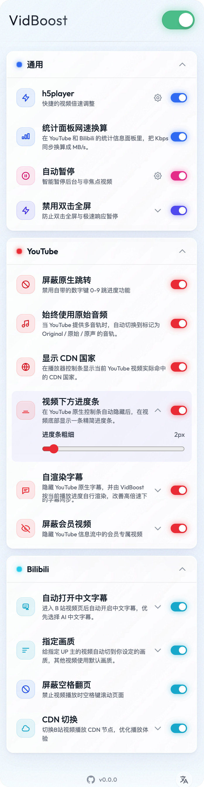
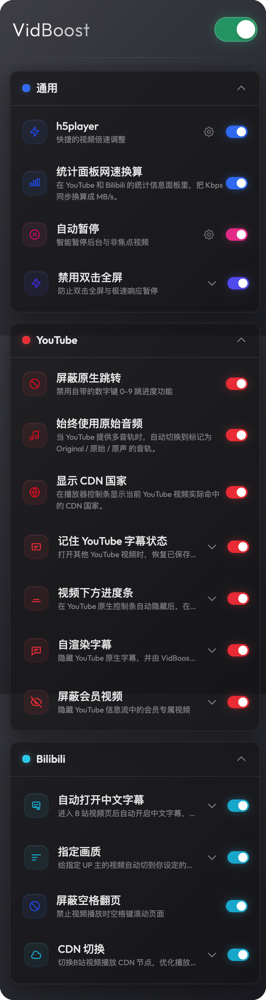
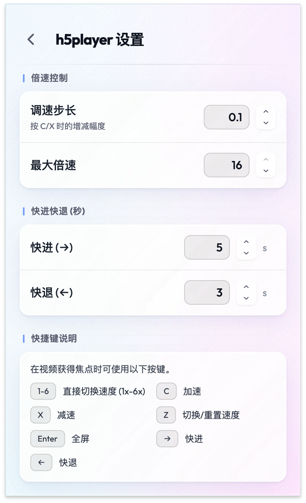
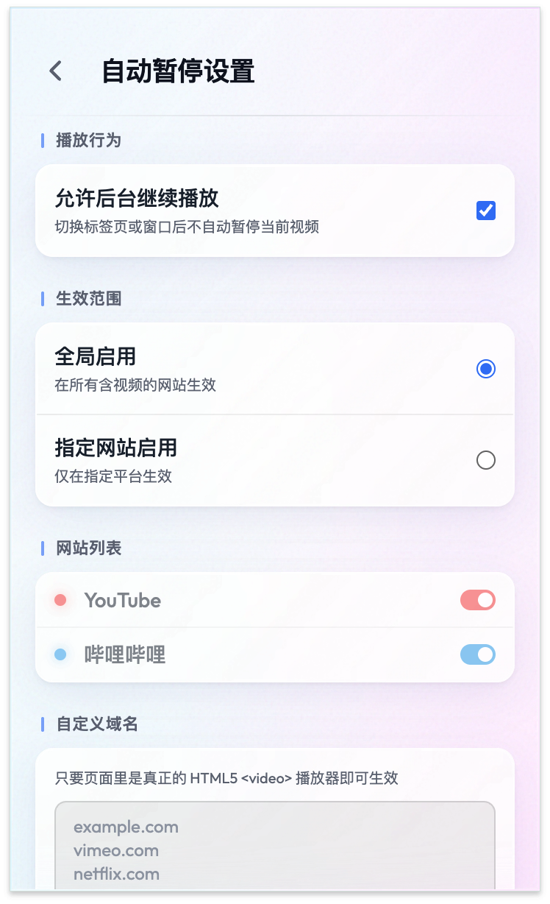
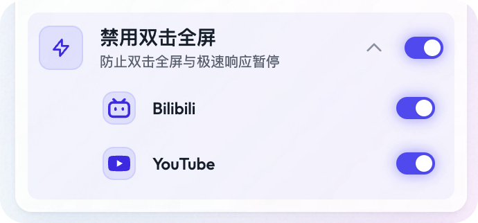
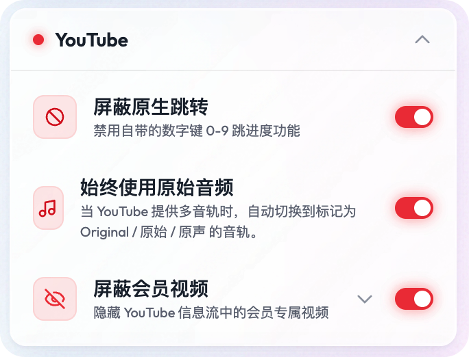
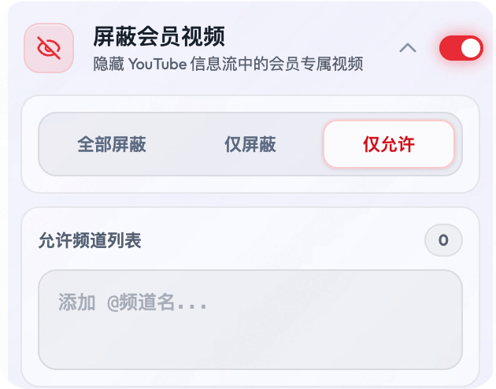
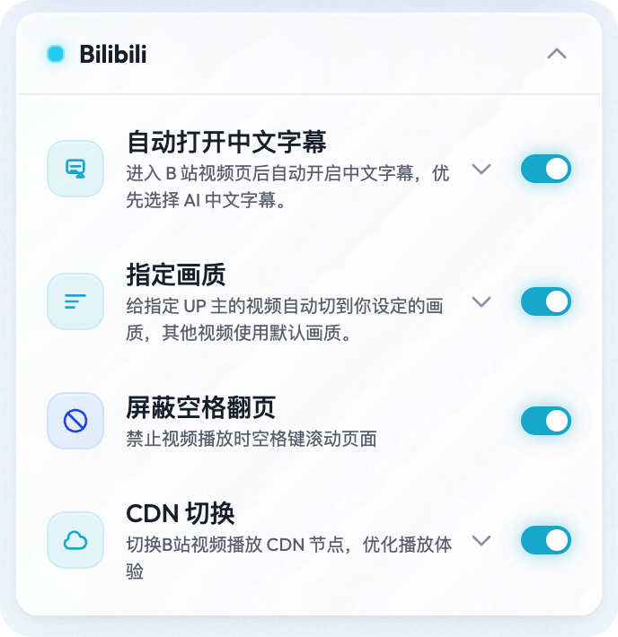
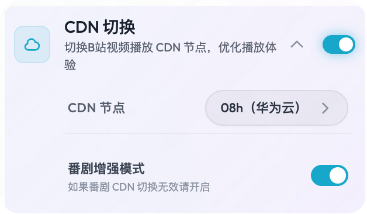
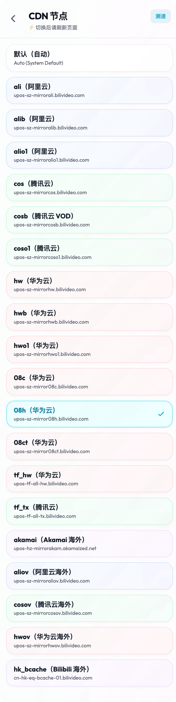

# VidBoost


VidBoost 是一个面向 Chrome / Edge 的视频增强扩展，用来把我自己长期在用的几类高频功能整合到一个稳定、统一、低打扰的入口里。

如果你平时会同时装好几个油猴脚本来处理倍速、后台暂停、误触全屏、YouTube / B 站专项优化，VidBoost 想做的就是把这些零散能力收拢成一个更省心的 Manifest V3 扩展。

- Chrome Web Store: [安装 VidBoost](https://chromewebstore.google.com/detail/vidboost/bjehghokgbfmceggcbpjgmahgjgpgbia?authuser=0&hl=zh-CN)

<p align="center">
  
  &nbsp;
  
</p>

## 为什么会有这个插件

- 把常用视频增强功能集中在一个入口里，不用再来回翻多个脚本和设置面板。
- 尽量减少脚本之间互相打架、设置分散、插件失效后还要重启浏览器这类割裂体验。
- 优先解决真正高频的场景，例如倍速切换、后台暂停、误触全屏、YouTube 和 B 站的站点级痛点。
- 实现上尽量控制常驻开销，只在页面里真正出现视频或相关场景时才激活逻辑。

## 功能总览

### 通用增强

#### 1. h5player 快捷倍速控制

适用于大多数 HTML5 视频网站，不只限于 YouTube 或 Bilibili。

- `1-6` 直接切到 1x-6x
- `C / X / Z` 加速、减速、切换或重置速度
- `Enter` 全屏
- `← / →` 快退、快进
- 支持自定义调速步长、最大倍速、快进快退秒数

这套功能我自己主要拿来看 YouTube、B 站、网课平台，也适用于很多常见 HTML5 视频站点。

新增兼容优化：
- 抖音高倍速守护。超过 `3x` 的倍速在抖音经常会被页面逻辑重置，VidBoost 会在你调到高倍速后尽量守住当前速度。

<p align="center">
  
</p>

#### 2. 自动暂停

切到别的标签页，或者浏览器窗口失焦时，正在播放的视频可以自动暂停；切回来之后再恢复播放。

支持的使用方式：

- 全站生效
- 仅对指定站点生效
- 自定义补充域名
- 允许后台继续播放，用来挂机听歌或播长音频

<p align="center">
  
</p>

#### 3. 极速暂停 / 禁用双击全屏

这个功能主要解决一个很具体但很高频的问题：想快速点击视频暂停，结果误触成双击全屏。

它会做两件事：

- 禁用视频区域双击全屏
- 尽量把暂停 / 播放响应前置，让高频点击更稳一些

目前主要针对 YouTube 和 Bilibili 这类高频点击场景做了适配。

<p align="center">
  
</p>

### YouTube 专属增强

<p align="center">
  
</p>

#### 1. 屏蔽原生数字键跳进度

YouTube 原生的 `0-9` 数字键是跳进度，和上面的快捷倍速是天然冲突的。

启用后可以拦掉这套原生行为，避免本来想切到 `3x`，结果视频直接跳到 `30%` 进度。

#### 2. 始终使用原始音频

这是后面新增的一项功能。

当 YouTube 视频提供多音轨时，VidBoost 会自动切换到标记为 `Original / 原始 / 原声` 的音轨，适合不想被自动配音、翻译音轨打断的场景。

- 支持普通视频页
- 支持 Shorts
- 只在页面存在多音轨时介入

#### 3. 屏蔽会员视频

YouTube 首页、订阅流等信息流里，经常会混进一些频道会员专属视频。

现在支持三种模式：

- 全部屏蔽
- 黑名单模式：只屏蔽你指定频道的会员视频
- 白名单模式：默认拦掉，只保留你允许的频道

<p align="center">
  
</p>

### Bilibili 专属增强

#### 1. 自动打开中文字幕

这是目前 README 里缺失、但代码里已经补上的功能之一。

进入 B 站视频页后，如果站点本身提供中文字幕，VidBoost 会自动帮你打开，并优先选择 AI 中文字幕。

支持的用法：

- 对全部视频生效
- 只对指定 UP 主生效
- 支持填写 UID、空间链接或昵称
- 可以直接把当前视频的 UP 一键加入白名单

常见的普通视频、番剧、收藏列表、稍后再看页面都能覆盖到。

#### 2. 屏蔽空格翻页

在 B 站看视频时，按空格本来是想控制播放，但页面有时会顺手一起滚动，这个功能就是专门拦这个问题的。

#### 3. CDN 切换与测速

当 Bilibili 默认 CDN 不稳定、速度差或海外网络体验不好时，可以手动切换到其他节点。

目前支持：

- 手动切换 Bilibili CDN 节点
- 对可用节点做真实测速
- 测试海外 / 香港节点
- 测速后自动选择最快节点
- 按测速结果排序查看
- 番剧增强模式

<p align="center">
  
</p>

<p align="center">
  
</p>

<details>
  <summary>展开查看完整的 B 站设置面板截图</summary>
  <p align="center">
    
  </p>
</details>

## 支持场景

- 通用 HTML5 视频网站：YouTube、Bilibili、各类网课平台，以及大多数标准 `<video>` 播放器站点
- 站点专项优化：YouTube、Bilibili、抖音
- 部分全屏适配已额外处理：爱奇艺、优酷、腾讯视频等

## 性能与权限说明

VidBoost 比较在意常驻时的开销，实现上会尽量收着来：

- 只在页面里真正检测到视频或对应站点场景时激活逻辑
- 统一管理输入监听和功能挂载，减少重复绑定
- 跨标签页状态同步尽量依赖浏览器原生能力，少走不必要的中转

当前主要用到的权限和原因：

- `storage`：保存功能开关和自定义设置
- `activeTab`：与当前标签页交互，例如读取当前页面信息或触发当前页相关功能

扩展也会向页面注入内容脚本，这是视频增强、站点适配和页面内播放器交互正常工作的前提。

## 安装

### 1. Chrome 商店安装

直接安装：

[Chrome Web Store - VidBoost](https://chromewebstore.google.com/detail/vidboost/bjehghokgbfmceggcbpjgmahgjgpgbia?authuser=0&hl=zh-CN)

### 2. 源码安装

```bash
git clone https://github.com/tunecc/VidBoost.git
cd VidBoost
npm install
npm run build
```

构建完成后，在 Chrome / Edge 的扩展管理页面加载 `dist` 目录即可。

## 开发

```bash
npm run check
npm run build
```

项目基于以下技术栈：

- TypeScript
- Svelte
- Vite
- Tailwind CSS
- Manifest V3

## 反馈与贡献

如果你也有类似的视频使用场景，欢迎提 Issue、功能建议或者直接发 PR。

- Issues: [https://github.com/tunecc/VidBoost/issues](https://github.com/tunecc/VidBoost/issues)
- 仓库地址: [https://github.com/tunecc/VidBoost](https://github.com/tunecc/VidBoost)
